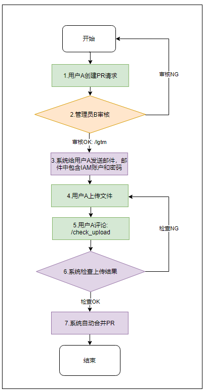
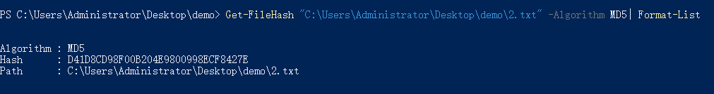
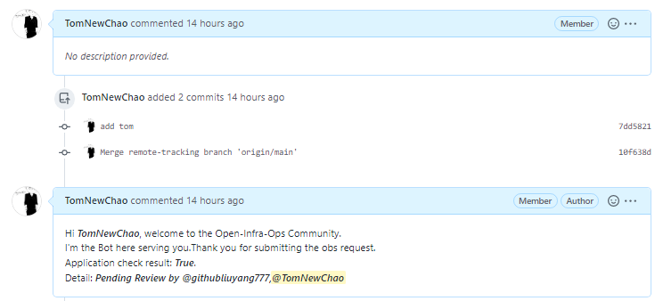
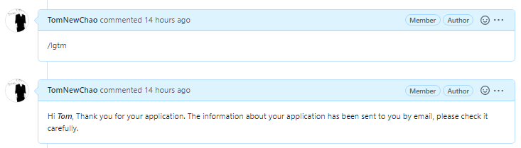
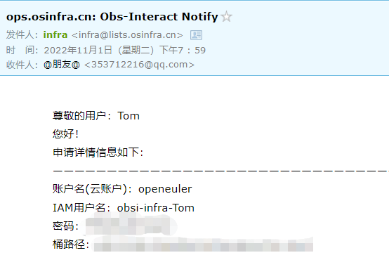
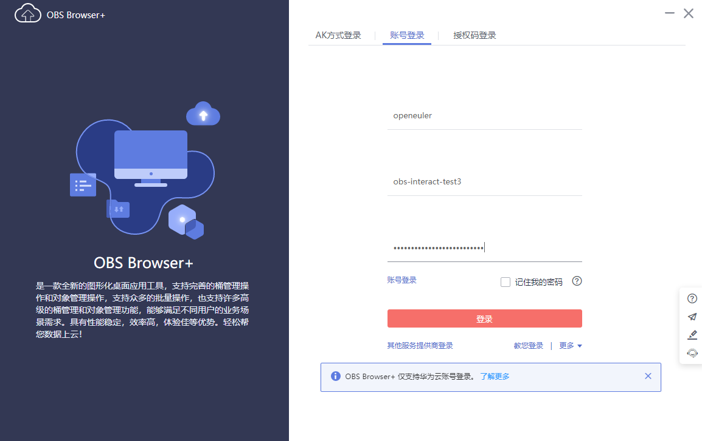
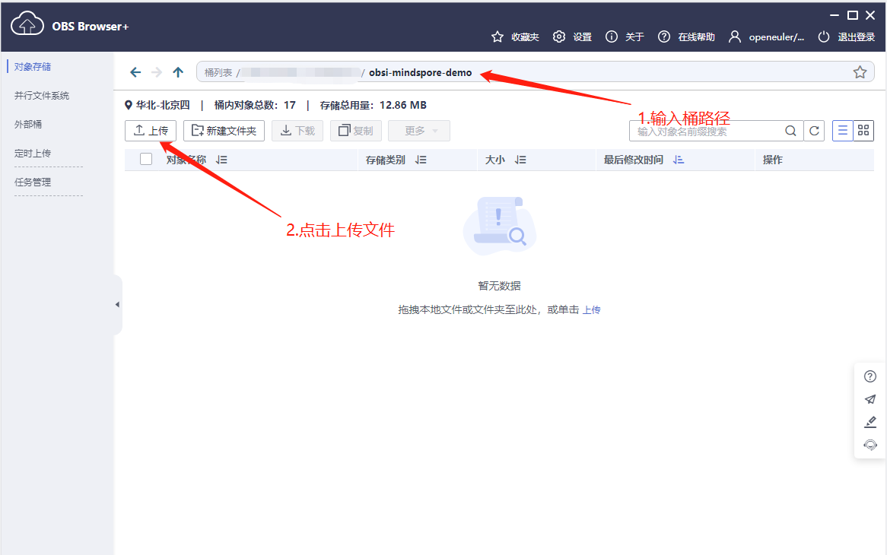
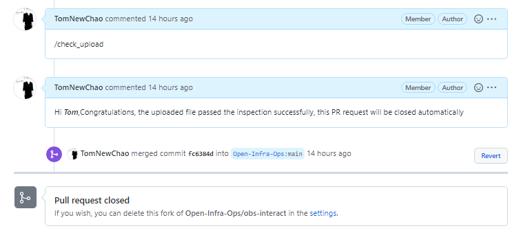

# obs-interact

## 1.功能

​		通过向本项目提交pr的方式实现文件上传OBS对象系统。

## 2.申请流程

### 1.申请流程

具体的流程步骤在第2章的`申请流程详解`中会着重阐述。

+ 用户需要完成步骤1,4,5。
+ 管理员需要完成步骤2。
+ 系统完成步骤3,6,7。

### 2.申请流程详解

1.用户A创建PR请求： 

+ 用户A需要fork本仓库，在对应社区下的文件夹创建yaml文件
  + yaml文件名称规范为：用户名.yaml，例如以下内容：

    ~~~bash
    zhu.yaml # 用户名, 用户名和文件名必须匹配，只能为英文+数字，不能有特殊字符，长度最长为15.
    ~~~

  + yaml文件内容参考模板文件： assert/zhu.yaml文件，详细见：[模板文]

    ~~~yaml
    username: zhu  # 用户名, 用户名和文件名必须匹配，只能为英文+数字，不能有特殊字符，长度最长为15
    community: Infra # 社区，只能从以下选其一：Infra、MindSpore、openGauss、openEuler、openLooKeng
    email: 3537**@qq.com   # 用于接受IAM账户和密码的邮件
    anonymously_read: true  # true：允许匿名用户读操作/false: 不允许匿名用户读操作
    file_list:
      - filename: demo/1.txt # 文件
        md5sum: 2114B22E1FC03ADEC16E40D85C646532  # 对文件进行md5进行计算
      - filename: 2.txt
        md5sum: D41D8CD98F00B204E9800998ECF8427E
    ~~~

  + 如何在win10上计算文件的md5sum

    点击桌面任一空白处打开，shift+ 鼠标右键，点击`在此处打开powershell窗口，然后在执行的窗口中输入一下命令： 

    ~~~bash
    Get-FileHash "C:\Users\Administrator\Desktop\demo\2.txt" -Algorithm MD5| Format-List
    ~~~

    显示md5如下图所示，将生成的Hash值填充到yaml文件中。
    

+ 将yaml文件填写完成后，向FORK仓库提交后，需要再向仓库`https://github.com/Open-Infra-Ops/obs-interact`创建PR请求。

+ 用户提交PR请求后，系统会在PR以评论的方式告知检查结果：

  

2.管理员B审核:

+ 用户A提交PR后，管理员需要向PR中提交的内容和提交人进行审核。

+ 管理员可以使用 `\check`进行后台内容检查。

+ 管理员可以使用`\lgtm`进行审核通过。如果不通过，则需要在PR中以评论的方式给出建议。

+ 管理员审核后，系统会在PR中以评论的方式告知处理结果，此时代表邮件已经发送。

  

3.系统给用户发送邮件，邮件内容包含IAM账户和密码

+ 待管理员审核通过后，用户会在yaml配置中的邮箱收到邮件。

+ 接收的邮件可能会在垃圾邮箱中，请注意查看，其大体内容如下：

  

4.用户A上传文件

+ 用户收到邮件后，需要先下载OBS客户端: obs-browser-plus

  obs-browser-plus客户端下载链接:   https://obs-community.obs.cn-north-1.myhuaweicloud.com/obsbrowserplus/win64/OBSBrowserPlus-HEC-win64.zip

  obs-browser-plus更多版本客户端下载链接:   https://developer.huaweicloud.com/tools#section-1

+ 下载后使用邮件中的信息进行登录。

  登录界面：

  输入账户名： 复制邮件中的账户名

  输入IAM用户名： 复制邮件中的IAM用户名

  输入密码： 复制邮件中的密码  

+ 登录后上传文件

  输入桶路径： 可以复制邮件中的桶路径

  

5.用户评论`/check_upload`

- 用户上传成功后，需要在pr中评论`/check_upload`进行上传数据检查

- 检查内容主要是： md5sum检查，防止上传文件不完整 /  lack文件检查，防止少传、漏传 /  敏感文件数据

- 怎么定义敏感数据？文件中带有以下后缀名， 或上传数据中存在手机号，邮件等内容。

  ~~~bash
  "sh", "java", "jsp", "sql", "conf", "cer", "php", "php5", "asp", "cgi", "aspx", "war", "bat","c", "cc", "cpp", "cs", "go", "lua", "perl", "pl", "py", "rb", "vb", "vbs", "vba", "h", "jar", "properties", "config", "class"
  ~~~

- 检查成功后，系统会以评论的方式告知结果，并进行自动合并

  

6.系统检查上传结果

+ 用户评论`/check_upload`， 后台会进行检查，检查失败会以评论的方式进行反馈，检查成功后自动合并PR请求，不需要手动请求触发。

7.系统自动合并PR请求

+ 系统检查成功后自动合并PR请求，当合并PR时，邮件发送的IAM账户会立马失效。

## 3.注意事项

1. 隐私声明： 用户填写的yaml的内容，本平台只能用于维护和管理用户的obs对象系统对应的文件夹，不会挪作他用。
2. 如果需要对原有上传的文件进行修改，在新提pr中不需要新创建yaml文件，只需要对原有yaml文件进行修改；一个用户在一个社区文件夹下具有唯一性； 用户可以在多个社区中具有相同名字的文件夹。
3. 用户可以在一个PR中提交对多个社区文件夹下的yaml文件进行修改。
