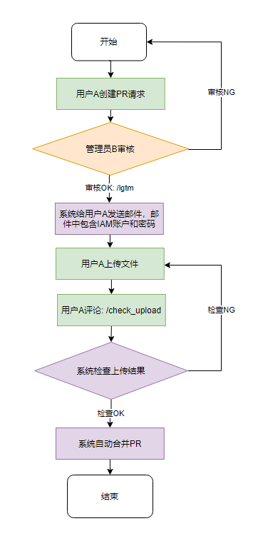

# obs-interact

## 1.功能

​		通过向本项目提交pr的方式实现文件上传OBS对象系统。

## 2.申请流程

### 1.申请流程

### 2.申请流程详解

1.用户A需要fork本仓库，在对应社区下的文件夹创建yaml文件

+ yaml文件名称规范为：用户名.yaml，例如以下内容：

  ~~~bash
  zhu.yaml
  ~~~

+ yaml文件内容参考模板文件： assert/zhu.yaml文件，详细见：[模板文](）

  ~~~bash
  username: zhu  # 用户名
  community: Infrastructure # 社区，只能从以下选其一：Infrastructure、MindSpore、openGauss、openEuler、openLooKeng
  email: 3537**@qq.com   # 用于接受IAM账户和密码的邮件
  anonymously_read: true  # true：允许匿名用户读操作/false: 不允许匿名用户读操作
  file_list:
    - filename: demo/1.txt # 文件路径
      md5sum: 2114B22E1FC03ADEC16E40D85C646532  # 对文件进行md5进行计算
    - filename: 2.txt
      md5sum: D41D8CD98F00B204E9800998ECF8427E
  ~~~

  + 如何在win10上计算文件的md5sum

  点击桌面任一空白处打开，shift+ 鼠标右键，点击**在此处打开powershell窗口**，然后在执行的窗口中输入一下命令： 

  ~~~bash
   Get-FileHash "C:\Users\Administrator\Desktop\demo\2.txt" -Algorithm MD5| Format-List
  ~~~

  显示md5如下图所示：
  

  将生成的md5sum补充到yaml文件中。

2.用户需要向本仓库提交pr请求， 经管理员审核后即可获取IAM账户和密码，使用华为云的工具obs-browser-plus进行上传文件（见下图）。如果审核不通过，则会以评论的方式提示审核不通过的原因。

obs-browser-plus客户端下载链接:   https://obs-community.obs.cn-north-1.myhuaweicloud.com/obsbrowserplus/win64/OBSBrowserPlus-HEC-win64.zip

obs-browser-plus更多版本客户端下载链接:   https://developer.huaweicloud.com/tools#section-1

登录界面：
  

3.用户上传成功后需要在对应的pr进行check检查，检查成功后系统会自动合入本次pr。如果检查失败，用户则需要根据失败原因重新上传文件。

## 3.注意事项

1. 隐私声明： 用户填写的yaml的内容，本平台只能用于维护和管理用户的obs对象系统对应的文件夹，不会挪作他用。
2. 如果需要对原有上传的文件进行修改，在新提pr中不需要新创建yaml文件，只需要对原有yaml文件进行修改，一个用户在一个社区文件夹下具有唯一性。
